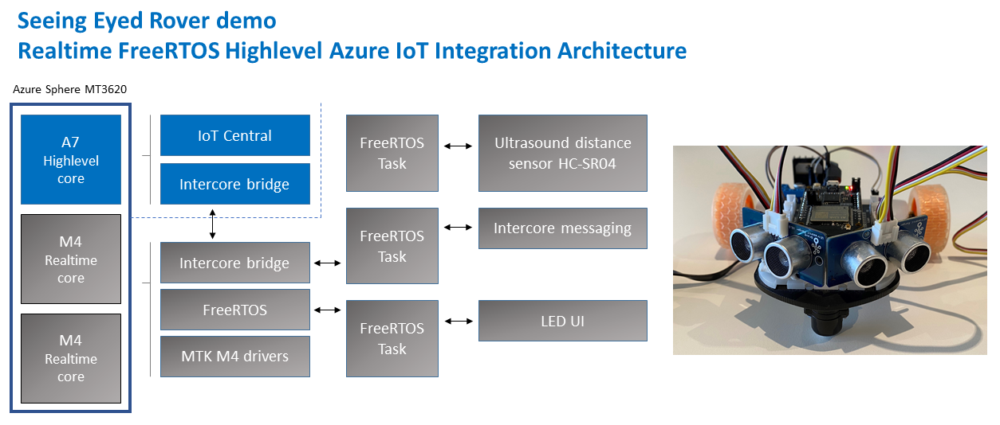

# You can too! Build a seeing eyed rover combining the best of Azure Sphere security and FreeRTOS

## What you will learn

You will learn how to integrate a Realtime FreeRTOS application responsible for running a timing sensitive ultrasonic distance sensor with the security and cloud connectivity of Azure Sphere.

---

## #JulyOT

This is part of the #JulyOT [IoT Tech Community](http://aka.ms/julyot) series, a collection of blog posts, hands-on-labs, and videos designed to demonstrate and teach developers how to build projects with Azure Internet of Things (IoT) services. Please also follow [#JulyOT](https://twitter.com/hashtag/JulyOT) on Twitter.

---

## Source code and learning resources

Source code: [Azure Sphere seeing eyed rover Realtime FreeRTOS sensors and Azure IoT](https://gloveboxes.github.io/Azure-Sphere-Rover-Bot-FreeRTOS-with-Azure-IoT/).

Learning resources: [Azure Sphere Developer Learning Path](https://github.com/gloveboxes/Azure-Sphere-Learning-Path).

---

## Learn more about Azure Sphere

[Azure Sphere](https://azure.microsoft.com/en-au/services/azure-sphere/?WT.mc_id=julyot-azd-dglover) is a comprehensive IoT security solution – including hardware, OS, and cloud components – to actively protect your devices, your business, and your customers.

Azure Sphere is made up of three interrelated components:

1. Azure Sphere-certified MCUs
2. Azure Sphere OS
3. Azure Sphere Security Service

---

## Azure Sphere Architecture

The initial release of the Azure Sphere is built on the Mediatec MT3620. This crossover MCU consists of 5 cores. There is a dedicated communications core, a dedicated Security Subsystem core, and **three** user application cores.

The **three applications cores** are as follows:

* 1 x  ARM Cortex A7 core running Embedded Linux (built with Yokto), exposing a set of POSIX APIs. Developers can build and deploy a **High Level** application to this core. This core is also responsible for the TrustZone Security Monitor, threat detection reporting, and OS and Application life cycle management.
* 2 x ARM Cortex M4Fs. Developers can build and deploy **Real Time** applications to these cores. Real Time applications can be built against the bare metal or built using  real time frameworks such as FreeRTOS and Azure RTOS.

With Visual Studio you can develop and debug applications running on all three cores. For example, you can simultaneously debug an app running on the A7 core and a M4 core FreeRTOS app.

---

## Solution architecture

--

## How to build

